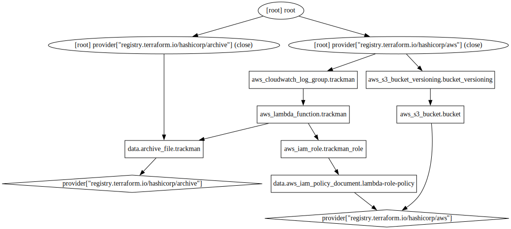

# Trackman Stats Scraper

A JavaScript AWS Lambda to pull my shot data from Trackman. 

The Trackman app is used to track your golf shots at a Trackman driving range, however the app has no data export functionality. This code uses the Trackman API endpoints used by the app to request the data and store it to Amazon S3.

## Technologies Used

* JavaScript
* Terraform
* AWS Lambda
* Amazon S3
* Amazon CloudWatch

## Terraform Infrasturcture

Output of `terraform graph` command:

